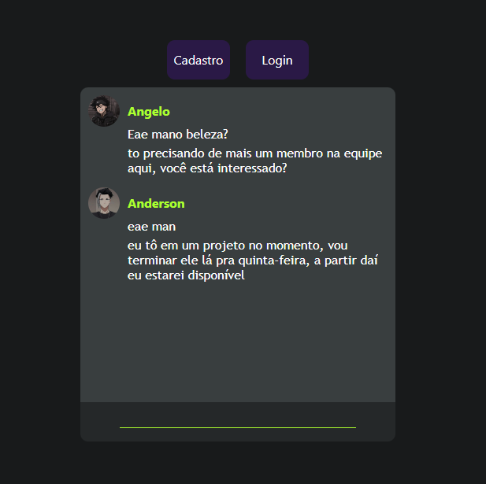

<h1 align="center"> ChatNTS </h1>

O ChatNTS é um projeto pessoal desenvolvido para conectar pessoas em um ambiente de chat. Foi construído com React.js, HTML, CSS e se comunica com uma API em PHP que se conecta a um banco de dados MySQL.  

  <a href="#-Tecnologias-Utilizadas">Tecnologias</a>&nbsp;&nbsp;&nbsp;|&nbsp;&nbsp;&nbsp;
  <a href="#-Funcionalidades">Funcionalidades</a>&nbsp;&nbsp;&nbsp;|&nbsp;&nbsp;&nbsp;
  <a href="#-Em-Desenvolvimento">Desenvolvimento</a>&nbsp;&nbsp;&nbsp;|&nbsp;&nbsp;&nbsp;
  <a href="#-Testes">Testes</a>&nbsp;&nbsp;&nbsp;|&nbsp;&nbsp;&nbsp;
  <a href="#-Em-Expansão">Expansão</a>

  

## 🚀 Tecnologias Utilizadas

- React.js
- HTML
- CSS
- PHP
- MySQL
- Figma
- VSCode
- Nrok

## 🕹 Funcionalidades

Tela de cadastro
Tela de login
Tela de chat
Comunicação com API em PHP

## 🔬 Em Desenvolvimento

O ChatNTS ainda está em desenvolvimento e o foco inicial é a funcionalidade de conexão entre usuários. Há muito a ser feito, incluindo:

- Melhoria na estilização
- Adição de animações suaves
- Página completa com menus
- Busca por mensagens
- Envio de foto de perfil
- Página de estatísticas

## 📡 Testes

O ChatNTS foi testado por usuários em diferentes locais do país, onde foi usado um computador como hospedagem e a tecnologia Nrok como ponte entre o servidor e os usuários, que estavam localizados em diferentes estados do Brasil.

Projeto Online: http://chatntsb.epizy.com/

## 🐱‍🏍 Em Expansão

Este projeto está em expansão e apresenta um potencial enorme para evolução e adição de novas funcionalidades, caso tenha interesse sinta-se a vontade para entrar em contato com o desenvolvedor e apresentar suas ideias, pensamentos e feedbacks.
